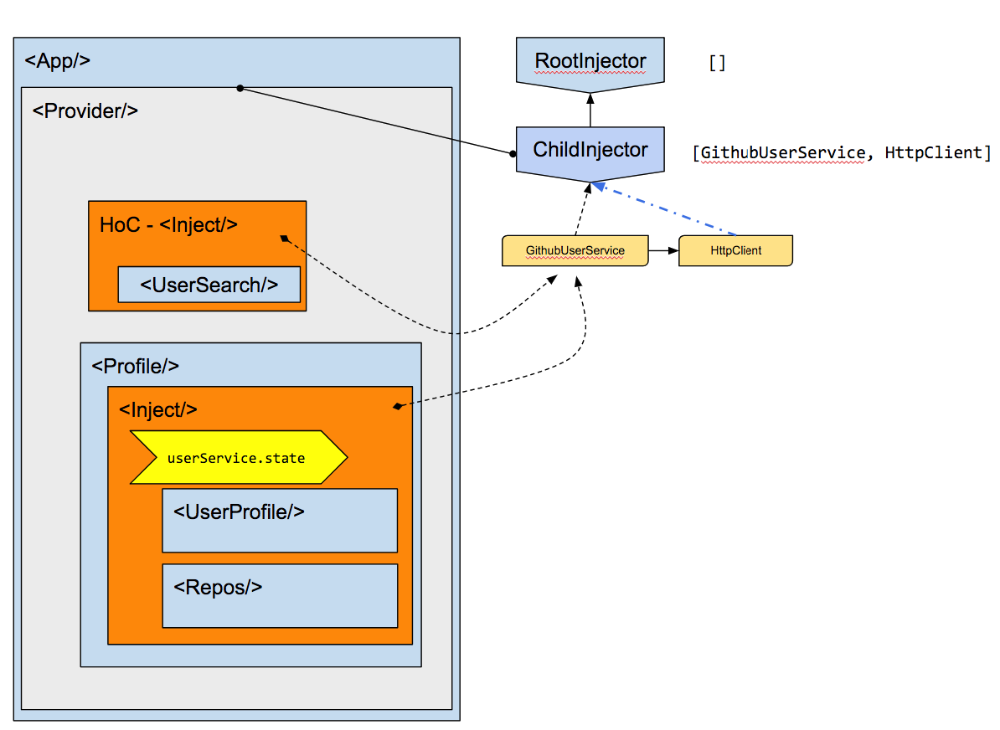

# rea-di

> Dependency injection for React done right. Hierarchical injection on both component and service layer powered by [injection-js](https://github.com/mgechev/injection-js) (Angular DI framework without Angular dependency 💪) 🖖
>
> rea-di [pronounced "Ready" 🤙]

[](https://greenkeeper.io/)

[](https://travis-ci.org/Hotell/rea-di)
[](https://www.npmjs.com/package/@martin_hotell/rea-di)

[](https://github.com/conventional-changelog/standard-version)
[](https://github.com/prettier/prettier)
[](https://conventionalcommits.org)

## Installing

```sh
yarn add @martin_hotell/rea-di

# install peer dependencies
yarn add react injection-js tslib

# install Reflect API polyfill
yarn add @abraham/reflection
```

> **Note:**
>
> You need a polyfill for the [Reflect API](http://www.ecma-international.org/ecma-262/6.0/#sec-reflection).
>
> We highly recommend tiny [reflection](https://www.npmjs.com/package/@abraham/reflection) polyfill ( 3kB only ! )
>
> Also for TypeScript you will need to enable `experimentalDecorators` and `emitDecoratorMetadata` flags within your `tsconfig.json`

## Getting started

Let's demonstrate simple usage with old good Counter example:

[](https://codesandbox.io/s/github/Hotell/rea-di/tree/master/examples/counter)

```tsx
import React, { Component } from 'react'
import { render } from 'react-dom'

import { Injectable } from 'injection-js'
import { DependencyProvider, Stateful } from '@martin_hotell/rea-di'

// we create injectable and state aware service

type State = Readonly<typeof initialState>
const initialState = {
  count: 0,
}

@Injectable()
export class CounterService extends Stateful<State> {
  readonly state = initialState

  increment() {
    this.setState((prevState) => ({ count: prevState.count + 1 }))
  }
  decrement() {
    this.setState((prevState) => ({ count: prevState.count - 1 }))
  }
  incrementIfOdd() {
    if (this.state.count % 2 !== 0) {
      this.increment()
    }
  }

  incrementAsync() {
    setTimeout(() => this.increment(), 1000)
  }
}

export class Counter extends Component {
  render() {
    return (
      // We request to inject CounterService instance, which will be provided by closest parent DependencyProvider(Injector) (in our case we created parent <DependencyProvider/>)
      // ☝️ `values` prop is an tuple of Tokens(tokens used to register provider to injector)
      // Now our injectables will be available within render prop, via positional arguments,  `[CounterService] -> ((counterService) => (...)`
      <Inject values={[CounterService]}>
        {(counterService) => (
          <p>
            Clicked: {counterService.state.count} times
            <button onClick={() => counterService.increment()}>+</button>
            <button onClick={() => counterService.decrement()}>-</button>
            <button onClick={() => counterService.incrementIfOdd()}>
              Increment if odd
            </button>
            <button onClick={() => counterService.incrementAsync()}>
              Increment async
            </button>
          </p>
        )}
      </Inject>
    )
  }
}

render(
  // We create Parent Injector via Provider component which will resolve CounterService and thus will make it available within whole app tree
  <DependencyProvider providers={[CounterService]}>
    <Counter />
  </DependencyProvider>,
  document.getElementById('root')
)
```

For more examples, see the following examples section 👀

## Examples

Go checkout [examples](./examples) !

## API

> rea-di API is tiny 👌. It starts and ends with components and javascript, 2 core things that we love React for ❤️

There are 2 components for registering and injecting services and 2 HoC(High order components) which just leverage former under the hood (if that's your preferred way of composition) and 1 service abstract class to make services state aware.

### DependencyProvider<{providers: Provider[], children: ReactElement}>

**Example:**

```tsx
<DependencyProvider providers={[ServiceOne]}>
  ...your tree...
</DependencyProvider>
```

### Inject<{values: Type[], children(...injectables)=>ReactNode}>

```tsx
<Inject values={[ServiceOne]}>{(serviceOne)=>...}</Inject>
```

> **NOTE:**
> if you need inject multiple providers you have to use `tuple` as TS won't properly infer array to strictly typed tuple:
>
> ```tsx
> <Inject values={tuple(ServiceOne, ServiceTwo)}>
>   {(serviceOne, serviceTwo) => <>...</>}
> </Inject>
> ```

### withDependencyProvider<T extends Provider[]>(...providers:T): React.ComponentClass

```tsx
class Root extends Component {
  /*...*/
}

const EnhancedRoot = withDependencyProvider(ServiceOne, ServiceTwo)(
  MyParentComponent
)
```

### `withInjectables<TokenMap extends {[propName:string]: Type}>(tokenMap): React.ComponentClass`

```tsx
// you can see that injectValuesMap is config object for withInjectables HoC,
// which will map those keys to your component props with proper instance registered by provided Token within injector
const injectValuesMap = { serviceOne: ServiceOne }

class MyComponentWithInjectables extends Component<typeof injectValuesMap> {
  /*...*/
}

const EnhancedComponent = withInjectables(injectValuesMap)(
  MyComponentWithInjectables
)

const Tree = () => <EnhancedComponent />
```

### `Stateful<S>`

Abstract class which implements `setState` on your service class. If you wanna handle state within your service you need to extend from this Base class and implement `state`, exactly like you would with `React.Component`

```ts
const initialState = {
  count: 0,
}

@Injectable()
class CounterService extends Stateful<typeof initialState> {
  readonly state = initialState
  inc() {
    this.setState((prevState) => ({ count: prevState.count + 1 }))
  }
  dec() {
    this.setState((prevState) => ({ count: prevState.count - 1 }))
  }
}
```

### `tuple<T extends any[]>(...args: T): T`

- helper function to be used within `<Inject/>` if you need to inject more than 1 injectable

Following will produce type errors as TypeScript will create array of unions instead of tuple type:

```tsx
<Inject values={[ServiceOne, ServiceTwo]}>
  /* this will not compile
    $ExpectType  (...args: Array<ServiceOne | ServiceTwo>) => ReactNode
  */
  {(serviceOne, serviceTwo) =<>...</>}
</Inject>
```

By using `tuple` identity helper, everything works as expected

```tsx
<Inject values={tuple(ServiceOne, ServiceTwo)}>
  /* $ExpectType (...args: [ServiceOne ServiceTwo]) => ReactNode */
  {((serviceOne, serviceTwo) = <>...</>)}
</Inject>
```

## Guides

<details>
<summary>Building a github user search</summary>

Let's build a simple github user search app, by leveraging `rea-di`.

This is what we're gonna build: 

And this is how DI tree will look like 

> For complete implementation/demo checkout [examples](./examples/github-user)

1.  Implementing GithubUserService

We need implement our service, which is a pure javascript class with to encapsulate logic for fetching user data from github. To make it work with `rea-di` and `injection-js` we need to annotate our class with `@Injectable()` decorator. Now we can leverage dependency injection via constructor injection, and inject an `HttpClient` [axios-http](https://github.com/Hotell/axios-http), which will be used for XHR.

We will implement 3 methods, for getting user info, user repos and one aggregated method for getting both.

```tsx
// user.service.ts
import { HttpClient } from '@martin_hotell/axios-http'
import { Injectable } from 'injection-js'

import { GithubUserRepo } from './repo.model'
import { GithubUser } from './user.model'

const endpointPath = 'users'

@Injectable()
export class GithubUserService {
  constructor(private http: HttpClient) {}
  getRepos(username: string) {
    return this.http.get<GithubUserRepo[]>(`${endpointPath}/${username}/repos`)
  }

  getUserInfo(username: string) {
    return this.http.get<GithubUser>(`${endpointPath}/${username}`)
  }

  getGithubInfo(username: string) {
    return Promise.all([
      this.getRepos(username),
      this.getUserInfo(username),
    ]).then(([repos, bio]) => ({ repos: repos.data, bio: bio.data }))
  }
}
```

1.  Wiring our app DI capabilities to React component tree via `rea-di`

Now let's wire our service with our React component tree:

```tsx
// app.tsx
import React, { Component } from 'react'
import { registerHttpClientProviders } from '@martin_hotell/axios-http'
import { DependencyProvider } from '@martin_hotell/rea-di'

import { Profile } from './components/profile'
import SearchUser from './components/search-user'
import { GithubUserService } from './user.service'

export class App extends Component {
  render() {
    return (
      <div>
        <h1>GitHub User Search 👀</h1>
        <DependencyProvider
          provide={[
            registerHttpClientProviders({ baseURL: 'https://api.github.com' }),
            GithubUserService,
          ]}
        >
          <>
            <SearchUser />
            <Profile />
          </>
        </DependencyProvider>
      </div>
    )
  }
}
```

Quite a lot happening there, let's go step by step

So we are using `<DependencyProvider>` component which has one prop, `provide`. We need to pass here all providers that we wanna make available for all descendant components on the tree from our injector.

In our case we need to register 2 Providers:

- `registerHttpClientProviders` - function provided by axios-http, which registers all internal providers and makes `HttpClient` injectable
- `GithubUserService` - our injectable service class

```tsx
<DependencyProvider
  provide={[
    registerHttpClientProviders({ baseURL: 'https://api.github.com' }),
    GithubUserService,
  ]}
>
  {/*...*/}
</DependencyProvider>
```

With that solved, we can inject service instances anywhere in our component tree via `<Inject/>` component or via `withInjectables()` High order component.

3.  Implementing SearchUser component

This component will handle our search form. On submit it will call methods from `GithubUserService` instance.

With that said, we need to inject `GithubUserService` to our component. We could use `<Inject>` within our render but for this case we wanna use `GithubUserService` outside `render` so HoC is a great candidate for this use case. And of course it's gonna be "injected" via React component injection, which is nothing else than old good React props ✌️.

```tsx
type Props = {
  userService: GithubUserService
}

export class SearchUser extends React.Component<Props> {
  private usernameRef = createRef<HTMLInputElement>()
  private submitBtnRef = createRef<HTMLButtonElement>()

  render() {
    return (
      <form onSubmit={(ev) => this._handleSubmit(ev)}>
        <input
          type="text"
          placeholder="github username..."
          ref={this.usernameRef}
        />
        <button type="submit" ref={this.submitBtnRef}>
          Search Github
        </button>
      </form>
    )
  }

  _handleSubmit(ev: SyntheticEvent<HTMLFormElement>) {
    ev.preventDefault()
    const username = this.usernameRef.current!
    const btn = this.submitBtnRef.current!

    // disable form on submit
    btn.disabled = true
    username.disabled = true

    // now we can fetch bio and repos of selected user by calling injected userService.getGithubInfo
    this.props.userService
      .getGithubInfo(username.value)
      .then(({ bio, repos }) => {
        btn.disabled = false
        username.disabled = false
        username.value = ''
      })
  }
}

// last step is to wire our SearchUser to DI container
export default withInjectables({ userService: GithubUserService })(SearchUser)
```

Hmm but something is missing here right ? We wanna save our fetched data... somewhere ! we could indeed store it within parent component or even in this one, but because we're already using DI, we can make our `GithubUserService` stateful. Let's do that first!

All we need to do to make injectable service stateful, is to extend it with `Stateful` generic abstract class, which implements `setState` method (the same like React.Component)

```tsx
// user.service.ts
import { Injectable } from 'injection-js'
import { Stateful } from '@martin_hotell/rea-di'

// (1) we define State from implementation (the same pattern as you're used to from React)
type State = Readonly<typeof initialState>
const initialState = {
  username: '',
  bio: null as GithubUser | null,
  repos: null as GithubUserRepo[] | null,
}

// (2) now we extend our class WithState<State>
@Injectable()
export class GithubUserService extends Stateful<State> {
  // (3) we set service our state
  readonly state = initialState

  constructor(private http: HttpClient) {
    super()
  }

  // (4) and we implement `setActiveUser` method which will update our internal service state
  setActiveUser(user: Partial<State>) {
    this.setState((prevState) => ({ ...prevState, ...user }))
  }

  getRepos(username: string) {
    /*...*/
  }

  getUserInfo(username: string) {
    /*...*/
  }

  getGithubInfo(username: string) {
    /*...*/
  }
}
```

With our stateful `GithubUserService` we can update `SearchUser._handleSubmit` method:

```tsx
// search-user.tsx
export class SearchUser extends Component<Props> {
  _handleSubmit(ev: React.FormEvent<HTMLFormElement>) {
    ev.preventDefault()
    const username = this.usernameRef.current!
    const btn = this.submitBtnRef.current!

    // disable form on submit
    btn.disabled = true
    username.disabled = true

    // first we set just username to our service state
    // this will trigger re-render on every component that injects userService
    this.props.userService.setActiveUser({ username: username.value })

    // now we can fetch bio and repos of selected user by calling injected userService.getGithubInfo
    this.props.userService
      .getGithubInfo(username.value)
      .then(({ bio, repos }) => {
        // we store resolved data (bio and repos) to our service state
        this.props.userService.setActiveUser({ bio, repos })

        // we enable our form again
        btn.disabled = false
        username.disabled = false
        username.value = ''
      })
  }
}
```

Now we need to implement the last part of our app. Rendering the User Profile Bio and Repos.

4.  Implementing Profile component

Our `GithubUserService` is stateful, so all we need to do is to inject it within our `Profile` component. This time we don't need to access `userService` outside `render` so using `<Inject>` is the perfect candidate for wiring up Profile with our DI tree.

```tsx
// profile.tsx
import { Inject } from '@martin_hotell/rea-di'
import React, { Component } from 'react'

import { GithubUserService } from '../user.service'
import { Repos } from './repos'
import { UserProfile } from './user-profile'

export class Profile extends Component {
  render() {
    return (
      // (1) we specify token tuple/array `GithubUserService`, with which we're saying what instance is gonna be injected  within children function arguments
      <Inject values={[GithubUserService]}>
        {(userService) => {
          // (2) we got our userService, and we use destructuring on its state
          const { username, repos, bio } = userService.state

          // (3) we render only when both bio and repos have been fetched and stored within our service instance
          if (bio && repos) {
            return (
              <div className="row">
                <div className="col sm-12 md-6">
                  <UserProfile username={username} bio={bio} />
                </div>
                <div className="col sm-12 md-6">
                  <Repos username={username} repos={repos} />
                </div>
              </div>
            )
          }

          // if username only is set, that means we are in submitting phase
          if (username) {
            return `Loading... ${username}`
          }
        }}
      </Inject>
    )
  }
}
```

And that's it!

For complete implementation/demo checkout [examples](./examples/github-user)

</details>

---

### State management within service layer

For developers with Angular background, storing state within Service is a must have. While that makes sense in Angular ( because handling state within Angular component is a mess ) in React this abstraction isn't needed that much as React component state is mostly sufficient for that purpose.

With `rea-di`, you can handle state on service layer although we encourage you to handle state internally in `Component.state` or via some store state management library ( like Redux ).

> For those familiar with `Unstated`, with `rea-di`, you got all unstated library power at your disposal within service layer and much more 🌻.

Ok let's look at our previous example. We handle users array state within `Users` Component. We can make our `UserService` state aware and make it handle our state and with that remove any state from our components.

```tsx
// app/services.ts
import { Stateful } from 'rea-di'

// (1) we define State type and initialState which needs to be implemented when we extend WithState
type State = typeof Readonly<initialState>
const initialState = {
  users: null as User[] | null,
}

@Injectable()
// (2) WithState<T> is a generic base class which provides `protected setState()` method and forces you to implement state within your service
export class UserService extends Stateful<State> {
  // constructor Injection
  constructor(private httpClient: HttpClient, private logger: Logger) {
    // (3) we need to call super() as we are extending BaseClass
    super()
  }

  // (4) we implement our service state
  readonly state: State = initialState

  getUsers(): Promise<User[]> {
    this.logger.log('get users fetch started')

    return this.httpClient.get('api/users').then((response)=>{
      // (5) when http finishes, we update our service state.
      // This state will work exactly like React state and will re-render components where it's used
      this.setState(()=>({users:response}))
    })
  }
}
```

With that implemented, we can update our `Users` component ( emove state handling from it)

```tsx
// app/users.tsx
type Props = {
  service: UserService
}

class Users extends Component<Props> {
  render() {
    const { service } = this.props
    return (
      <div>
        {service.state.users ? (
          'Loading users...'
        ) : (
          <UserList users={service.state.users} />
        )}
      </div>
    )
  }
  componentDidMount() {
    // we only trigger HTTP call via our injected service. State will be handled and updated internally in that service
    this.props.service.getUsers()
  }
}
```

### Writing tests

Testing belongs to one of the main areas where DI framework shines!

How to test our components with rea-di ?

You just provide mocks of your services for both unit and integration tests and you're good to go 👌. Old good React ❤️

```tsx
import { DependencyProvider } from 'rea-di'

const DATA: Users[] = [{ name: 'Martin' }, { name: 'John' }]

class UserServiceMock extends UserService {
  getUsers = jest.fn(() => this.setState(() => ({ users: DATA })))
}

describe('<Users/> Unit Test', () => {
  it('should fetch users and render them', () => {
    const service = new UserServiceMock()
    const wrapper = mount(<Users service={service} />)

    expect(service.getUsers).toHaveBeenCalled()
    expect(service.state).toEqual({ users: DATA })
    expect(wrapper.find(UserList)).toBe(true)
  })
})

describe('<UsersModule/> Integration Test', () => {
  it('should fetch users and render them', () => {
    const wrapper = mount(
      // we create new ChildInjector with same token, just changing the Implementation that's gonna be instantiated ;)
      <DependencyProvider
        providers={[{ provide: UserService, useClass: UserServiceMock }]}
      >
        <UserModule />
      </DependencyProvider>
    )

    expect(service.getUsers).toHaveBeenCalled()
    expect(service.state).toEqual({ users: DATA })
    expect(wrapper.find(UserList)).toBe(true)
  })
})
```

---

## Publishing

Execute `yarn release` which will handle following tasks:

- bump package version and git tag
- update/(create if it doesn't exist) CHANGELOG.md
- push to github master branch + push tags
- publish build packages to npm

> releases are handled by awesome [standard-version](https://github.com/conventional-changelog/standard-version)

### Pre-release

- To get from `1.1.2` to `1.1.2-0`:

`yarn release --prerelease`

- **Alpha**: To get from `1.1.2` to `1.1.2-alpha.0`:

`yarn release --prerelease alpha`

- **Beta**: To get from `1.1.2` to `1.1.2-beta.0`:

`yarn release --prerelease beta`

### Dry run mode

See what commands would be run, without committing to git or updating files

`yarn release --dry-run`

### Check what files are gonna be published to npm

- `yarn pack` OR `yarn release:preflight` which will create a tarball with everything that would get published to NPM

## Tests

Test are written and run via Jest 💪

```
yarn test
# OR
yarn test:watch
```

## Style guide

Style guides are enforced by robots, I meant prettier and tslint of course 🤖 , so they'll let you know if you screwed something, but most of the time, they'll autofix things for you. Magic right ?

### Style guide npm scripts

```sh
#Format and fix lint errors
yarn ts:style:fix
```

## Generate documentation

`yarn docs`

## Commit ( via commitizen )

- this is preferred way how to create conventional-changelog valid commits
- if you prefer your custom tool we provide a commit hook linter which will error out, it you provide invalid commit message
- if you are in rush and just wanna skip commit message validation just prefix your message with `WIP: something done` ( if you do this please squash your work when you're done with proper commit message so standard-version can create Changelog and bump version of your library appropriately )

`yarn commit` - will invoke [commitizen CLI](https://github.com/commitizen/cz-cli)

### Troubleshooting

## Licensing

[MIT](./LICENSE.md) as always
