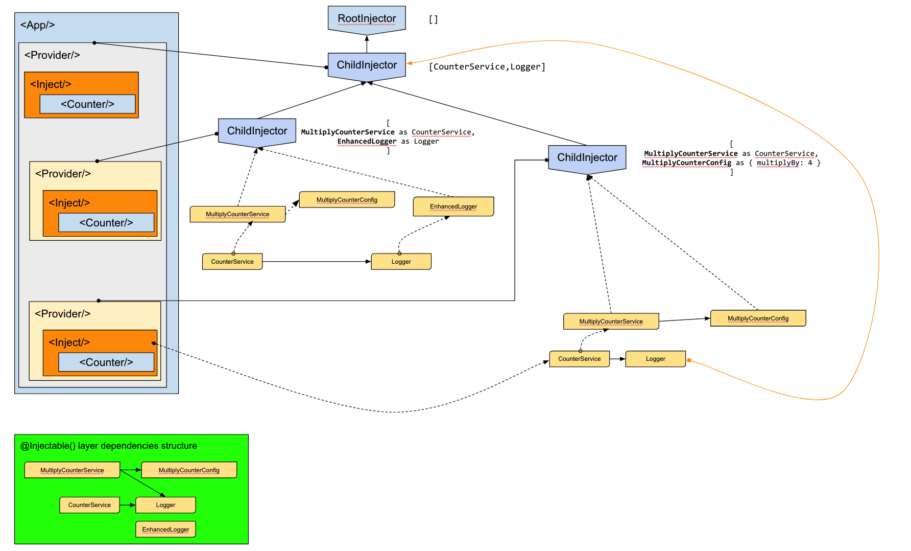

# Counter with Multiple Injectors and hierarchies app

Run the [Counter with Multiple Injectors and hierarchies app](.) example:

```
git clone https://github.com/hotell/rea-di.git

cd rea-di/examples/counter-with-multiple-injectors
yarn install
yarn start
```

Or check out the [sandbox](https://codesanbox.io/).

## Injector tree


