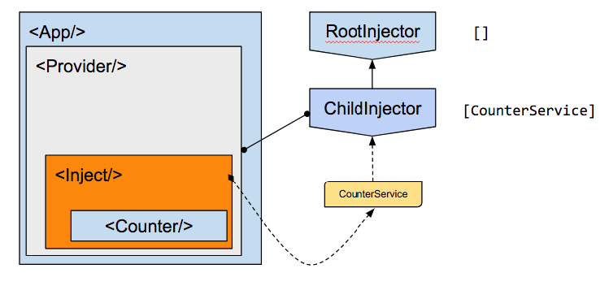

# Counter app

Run the [Counter](.) example:

```
git clone https://github.com/hotell/rea-di.git

cd rea-di/examples/counter
yarn install
yarn start
```

Or check out the [sandbox](https://codesandbox.io/s/github/Hotell/rea-di/tree/master/examples/counter).

## Injector tree


