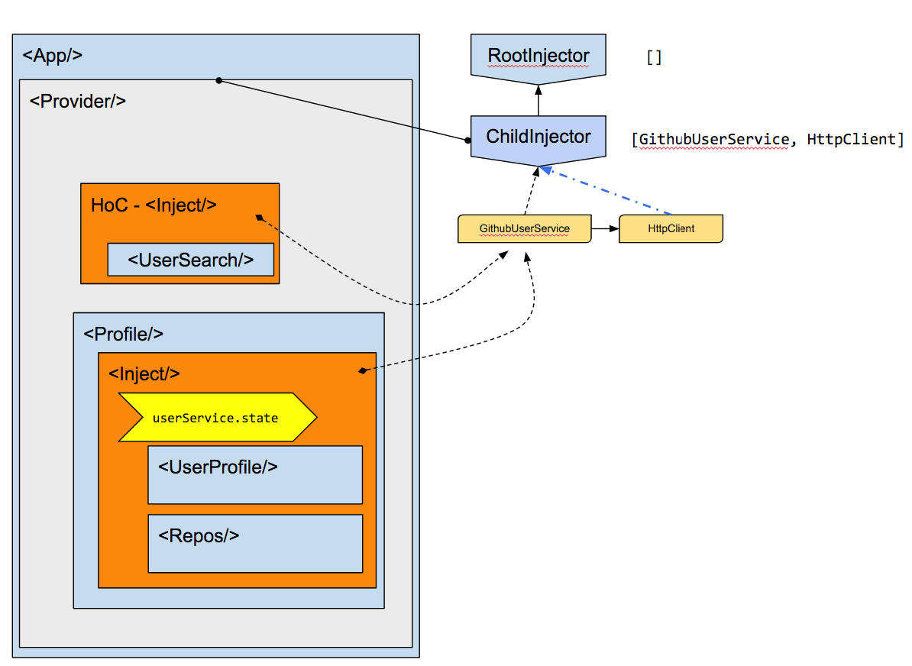

# Github User Search app

Run the [Github User Search](.) example:

```
git clone https://github.com/hotell/rea-di.git

cd rea-di/examples/github-user
yarn install
yarn start
```

Or check out the [sandbox](https://codesanbox.io/).

## Injector tree


